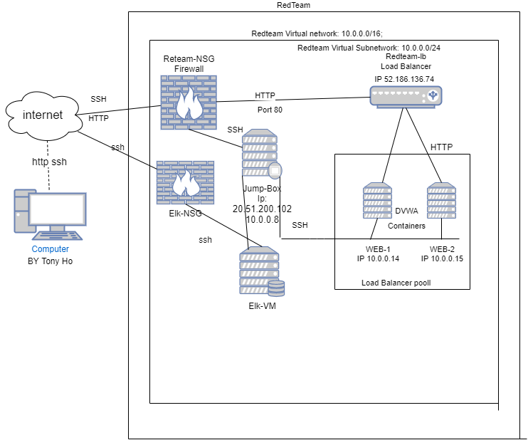
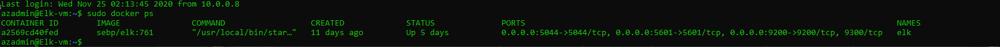
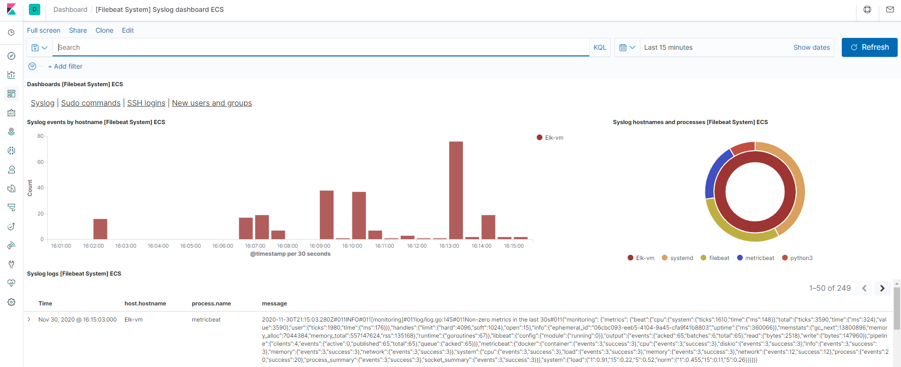

## Automated ELK Stack Deployment

Config by Tony Ho

The files in this repository were used to configure the network depicted below.

These files have been tested and used to generate a live ELK deployment on Azure. They can be used to either recreate the entire deployment pictured above. Alternatively, select portions of the [install-elk.yml] file may be used to install only certain pieces of it, such as Filebeat.

  - [install-elk.yml]

This document contains the following details:
- Description of the Topology
- Access Policies
- ELK Configuration
  - Beats in Use
  - Machines Being Monitored
- How to Use the Ansible Build

### Description of the Topology

The main purpose of this network is to expose a load-balanced and monitored instance of DVWA, the D*mn Vulnerable Web Application.

Load balancing ensures that the application will be highly [available], in addition to restricting [traffic] to the network.
- [availability]

Integrating an ELK server allows users to easily monitor the vulnerable VMs for changes to the [Logs] and system [traffic].
- _TODO: What does Filebeat watch for? [log files and log events]
- _TODO: What does Metricbeat record?
[Filebeat is a lightweight shipper for forwarding and centralizing log data. Installed as an agent on your servers, Filebeat monitors the log files or locations that you specify, collects log events, and forwards them either to Elasticsearch or Logstash for indexing.

Metricbeat is a lightweight shipper that you can install on your servers to periodically collect metrics from the operating system and from services running on the server. Metricbeat takes the metrics and statistics that it collects and ships them to the output that you specify, such as Elasticsearch or Logstash.]

The configuration details of each machine may be found below.
_Note: Use the [Markdown Table Generator](http://www.tablesgenerator.com/markdown_tables) to add/remove values from the table_.

| Name            | Function     | IP Address             | Operating System |
|-----------------|--------------|------------------------|------------------|
| Jump-Box        | Gateway      | 10.0.0.8               | Linux            |
| Web-1           | UbuntuServer | 10.0.0.14              | Linux            |
| Web-2           | UbuntuServer | 10.0.0.15              | Linux            |
| ELKVM           | UbuntuServer | 10.2.0.7               | Linux            |

### Access Policies

The machines on the internal network are not exposed to the public Internet. 

Only the [Jump-Box-Provisioner] machine can accept connections from the Internet. Access to this machine is only allowed from the following IP addresses:
- I added my ip [73.81.30.82]

Machines within the network can only be accessed by [Jump-Box through SSH].
- Which machine did you allow to access your ELK VM? What was its IP address?
- Jumpbox [10.0.0.8]

A summary of the access policies in place can be found in the table below.

| Name     | Publicly | Allowed IP Addresses |
|----------|----------|----------------------|
| Jump-Box | Yes      | 20.51.200.102        |
| Web-1    | No       | 10.0.0.14            |
| Web-2    | No       | 10.0.0.15            |
| ELKVM    | NO       | 10.2.0.7             |

### Elk Configuration

Ansible was used to automate configuration of the ELK machine. No configuration was performed manually, which is advantageous because...
- What is the main advantage of automating configuration with Ansible?
- you can put a command from multiple servers into a single playbook.

The playbook implements the following tasks:
- In 3-5 bullets, explain the steps of the ELK installation play. E.g., install Docker; download image; etc.
- ... install docker IO
- ... install python pip
- ... install docker
- ... systemctl -w vm.max_map_counts=26144
- ... install docker module
- ... install virtual memory
- ... use more memory
- ... download and launch docker container
The following screenshot displays the result of running `docker ps` after successfully configuring the ELK instance.

- 

### Target Machines & Beats
This ELK server is configured to monitor the following machines:
- List the IP addresses of the machines you are monitoring
- Web-1 [10.0.0.14]
- Web-2 [10.0.0.15]

We have installed the following Beats on these machines:
- Specify which Beats you successfully installed
[Filebeat and MetricBeat]

These Beats allow us to collect the following information from each machine:
- In 1-2 sentences, explain what kind of data each beat collects, and provide 1 example of what you expect to see. E.g., `Winlogbeat` collects Windows logs, which we use to track user logon events, etc.
- File Beat collect the changes done and MetricBeat collects metrics and statistic.
-  

### Using the Playbook
In order to use the playbook, you will need to have an Ansible control node already configured. Assuming you have such a control node provisioned: 

SSH into the control node and follow the steps below: 
- Copy the [yml] file to [ansible].
- Update the [config] file to include...
- Run the playbook, and navigate to [kibana] to check that the installation worked as expected.

 Answer the following questions to fill in the blanks:_
- Which file is the playbook? Where do you copy it? [/etc/ansible/hosts]
- Which file do you update to make Ansible run the playbook on a specific machine? How do I specify which machine to install the ELK server on versus which to install Filebeat on?_ 
- By editing the /etc/ansible/hosts file with the appropriate addresses.
- Which URL do you navigate to in order to check that the ELK server is running? 
- [http://20.51.123.1:5601/app/kibana#/home]

_As a **Bonus**, provide the specific commands the user will need to run to download the playbook, update the files, etc._